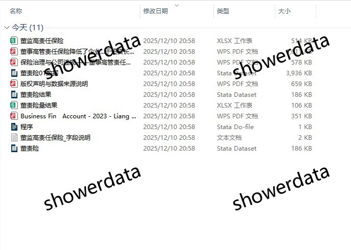
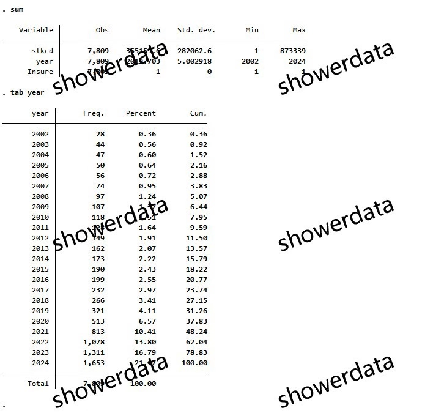
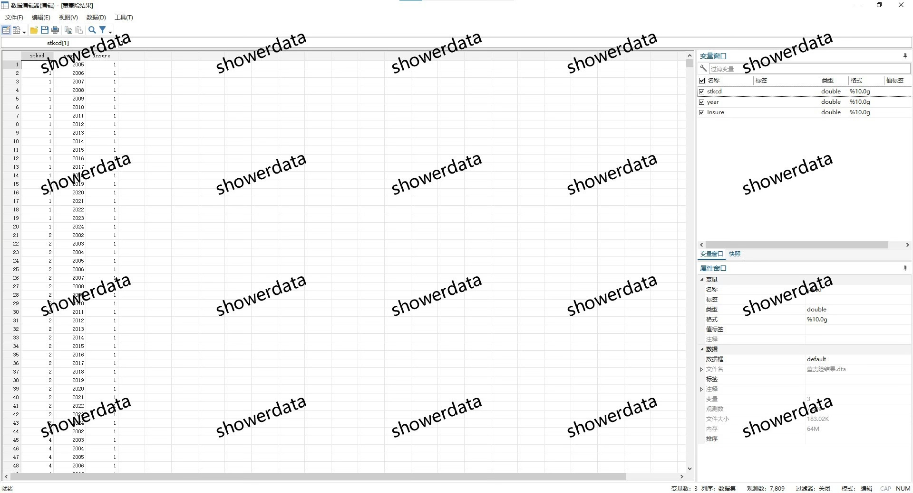
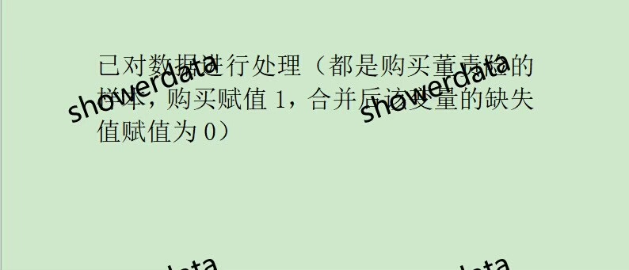
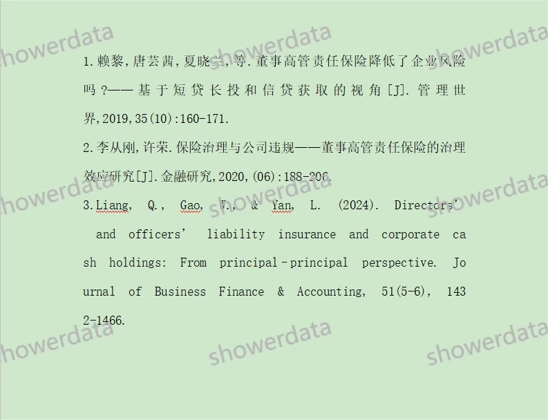

## Body

（2002-2024年）董监高责任保险

一、数据介绍
数据名称：上市公司-董监高责任保险
样本范围：A鼓尚视公司, 7809条观测值（未剔除）
时间范围：2002-2024年
数据格式：excel、dta
数据内容：结果（使用excel计算，无do文件）、参考文献

二、数据结果指标如图所示

三、计算方法如图所示

四、参考文献如图所示

## Images

item_1002242353452

Here is a pay link on Stripe ( https://buy.stripe.com/3cs8yP7sY87d0vu9AB ). Please contact me lonlonago@foxmail.com after funding $89, and I will send you a complete data files , thank you!

